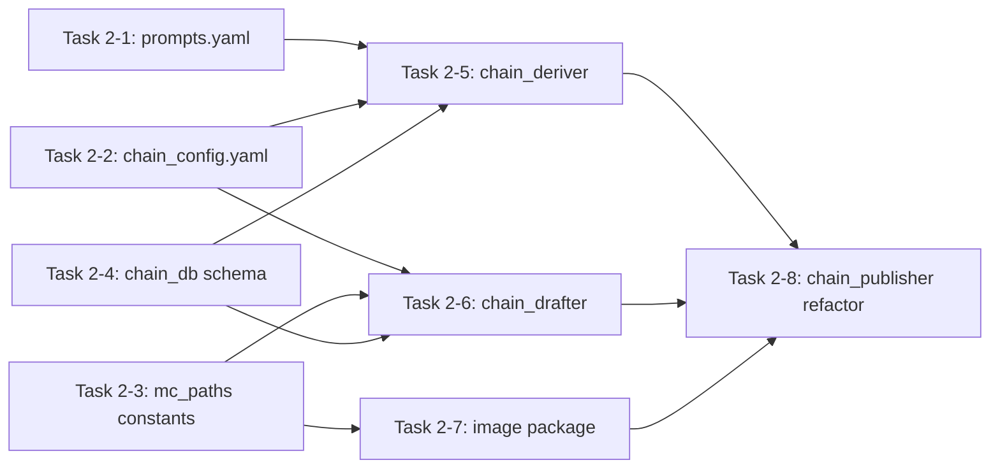

# Phase 2 Plan: AI Content Generation

**Phase:** 2
**Goal:** 키워드 성격에 맞는 체인 방향 자동 선택 → AI 주제 도출 → 글 초안 작성 → 이미지 생성
**Requirements:** DERV-01..03, DRAFT-01..03, IMG-01..05 (partial)
**Status:** Draft — awaiting approval

---

## Tasks

### Task 2-1: `config/prompts.yaml` — derive 확장 + draft 교체

**Scope:** 
- derive 섹션: 단일 프롬프트 → 키워드 방향별 3종 프롬프트 (depth/swallow/lateral)
- draft 섹션: 사용자 글쓰기 프롬프트 + mc 체인 컨텍스트 병합

**derive 섹션 Actions:**
1. `derive_system` 유지 (역할 정의)
2. `derive_user` → `derive_user_depth`, `derive_user_swallow`, `derive_user_lateral` 3종으로 분리
   - Depth: IT/기술/이슈 키워드용 — 깊이 파고들기 (기초→응용→심화)
   - Swallow: 쇼핑/소비 키워드용 — 역방향 확장 (소비→절약→금융)
   - Lateral: 여행/지역/리뷰 키워드용 — 횡방향 확장 (주제→비교→비즈니스)
3. 각 방향별 Step 1/2/3의 title, angle, category_guess, bridge_logic 포함

**draft 섹션 Actions:**
1. `draft_system` → 사용자 글쓰기 프롬프트 전문 (SEO, Frontmatter, Output Checklist 등)
2. `draft_user` → mc 변수 주입 템플릿: `{blog_name}`, `{target_keyword}`, `{title}`, `{angle}`, `{step}`, `{depth_role}`, `{prev_context}`, `{next_context}`
3. 이미지 플레이스홀더 포함: `<!-- thumbnail: ... -->`, `<!-- image: ... -->`

**Files:** `config/prompts.yaml` (edit)

---

### Task 2-2: `config/chain_config.yaml` — chain_type 필드 추가

**Scope:** 각 블로그에 `chain_type` (depth/swallow/lateral) 추가

**Actions:**
1. `chain_blogs` 아래 각 depth에 `chain_type` 필드 추가 (기본값: depth)
2. 추후 키워드 분류 결과에 따라 재설정 가능하게 구조화
3. direction_step_role: 각 방향별 Step 역할명 정의

```yaml
chain_blogs:
  0:
    site: rotcha
    chain_type: swallow  # or depth / lateral
    direction_roles:
      depth:    { step1: "기초/정보형", step2: "분석/응용형", step3: "전문/심화형" }
      swallow:  { step1: "구매/소비형", step2: "절약/관리형", step3: "금융/투자형" }
      lateral:  { step1: "주제/정보형", step2: "비교/탐색형", step3: "비즈니스/확장형" }
```

**Files:** `config/chain_config.yaml` (edit)

---

### Task 2-3: `mc_paths.py` — 경로 상수 추가

**Scope:** `chain_drafter.py` 등이 참조할 경로 상수 정의

**Actions:**
1. `PROMPTS_PATH = os.path.join(CONFIG_DIR, "prompts.yaml")`
2. `CHAIN_CONFIG_PATH = os.path.join(CONFIG_DIR, "chain_config.yaml")`
3. `MC_DB_PATH` — chain_config.yaml의 `db_path` 읽기
4. `DRAFTS_DIR = os.path.join(PROJECT_ROOT, "output", "drafts")`
5. `OUTPUT_DIR = os.path.join(PROJECT_ROOT, "output")`

**Files:** `mc_paths.py` (edit)

---

### Task 2-4: `chain_db.py` — 스키마 업그레이드

**Scope:** chain_posts + chains 테이블에 Phase 2 컬럼 추가

**Actions:**
1. `chains` 테이블: `chain_type TEXT DEFAULT 'depth'` 컬럼 추가
2. `chain_posts` 테이블: `draft_md TEXT`, `slug TEXT` 컬럼 추가
3. `chain_posts` 테이블: `chain_type TEXT` 컬럼 추가 (각 post의 실제 방향)
4. `update_post_draft(post_id, draft_md, slug)` 함수 추가
5. `update_chain_type(chain_id, chain_type)` 함수 추가
6. 마이그레이션을 `init_db()` 시작 시 실행

**Files:** `chain_db.py` (edit)

---

### Task 2-5: `chain_deriver.py` — 키워드 분류 + 방향별 derive

**Scope:** seed 키워드 자동 분류 → 방향별 derive 프롬프트 라우팅

**Actions:**
1. 키워드 성격 분류 로직 구현:
   - `_classify_keyword(keyword) → "shopping" | "tech" | "travel" | "issue" | "general"`
   - 분류 규칙: 쇼핑/브랜드/제품 → shopping, IT/기술/프로그래밍 → tech, 여행/지역/맛집 → travel, 이슈/시사/트렌드 → issue
2. 성격 → 체인 방향 매핑:
   - shopping → swallow
   - tech → depth
   - travel → lateral
   - issue → depth
   - general → depth (fallback)
3. `derive_chain()`에 `chain_type` 파라미터 추가 (기본값: auto-classify)
4. `derive_chain()` 내 derive_prompt 선택 분기:
   - `chain_type == "depth"` → `derive_user_depth`
   - `chain_type == "swallow"` → `derive_user_swallow`
   - `chain_type == "lateral"` → `derive_user_lateral`
5. derive 결과 저장 시 `chain_type`도 함께 저장
6. 사용자 override: `derive_chain(seed, chain_type="swallow")` 로 수동 지정 가능

**Files:** `chain_deriver.py` (edit)

---

### Task 2-6: `chain_drafter.py` — 신규 (초안 생성 모듈)

**Scope:** `chain_publisher.py`의 인라인 `draft_post()` / `_build_chain_context()` 분리

**Functions:**
- `_load_prompts()` — `mc_paths.PROMPTS_PATH` 로드
- `_build_prev_context(posts, current_step)` — 이전 포스트 컨텍스트 문자열
- `_build_next_context(posts, current_step)` — 다음 포스트 컨텍스트 문자열
- `_build_slug(title, keyword)` — Hugo-safe slug + 날짜 suffix
- `draft_single_post(post, posts, seed_keyword)` — AI generate() 호출
- `draft_chain(chain_id, seed_keyword)` — 체인 전체 3개 포스트 초안 생성
- `review_drafts(chain_id)` — 운영자 검토 체크포인트

**초안 저장:**
- DB: `chain_posts.draft_md`, `chain_posts.slug`, `status = 'drafted'`
- 파일: `output/drafts/{chain_id}/step-{N}-{slug}.md`

**Files:** `chain_drafter.py` (new)

---

### Task 2-7: `image/` 패키지 — 신규 3개 파일

#### 2-7a: `image/__init__.py`
- 패키지 마커

#### 2-7b: `image/pollinations_client.py`
- `generate_image(prompt, save_path, width=1200, height=630, seed=42, max_retry=3) → bool`
- `generate_post_images(slug, thumb_prompt, content_prompt, static_images_dir, seed=42) → dict`
- Rate limit: 16s delay
- Hugo `static/images/{slug}/` 저장, URL 반환

#### 2-7c: `image/prompt_builder.py`
- `build_image_prompts(keyword, title, angle) → {"thumbnail": "...", "content": "..."}`
- GPT로 한국어 주제 → 영어 이미지 프롬프트 변환
- JSON 파싱 실패 시 fallback

#### 2-7d: `image/injector.py`
- `inject_images(draft_md, slug, thumbnail_url, content_url, alt_text) → str`
- Frontmatter `image:` 필드 삽입
- `<!-- thumbnail: -->` / `<!-- image: -->` 주석을 실제 이미지 태그로 교체

**Files:** `image/__init__.py`, `image/pollinations_client.py`, `image/prompt_builder.py`, `image/injector.py` (new)

---

### Task 2-8: `chain_publisher.py` — 리팩터 + --draft 플래그

**Scope:** 인라인 함수 제거, 새 모듈 연결, CLI에 --draft 추가

**Actions:**
1. `draft_post()` 제거
2. `_build_chain_context()` 제거
3. `generate_image()` 제거
4. Import 추가: `from chain_drafter import draft_chain, review_drafts`
5. Import 추가: `from image.prompt_builder import build_image_prompts`
6. Import 추가: `from image.pollinations_client import generate_post_images`
7. Import 추가: `from image.injector import inject_images`
8. `--draft` CLI 플래그 추가
9. `chain_type` 파라미터 추가 (auto-classify 또는 수동 지정)
10. `if draft:` 블록: derive → draft_chain → review_drafts → image 생성 파이프라인

**IMPORTANT:** `--seed` (Phase 1 derive)와 `--dry-run` (Phase 1 검증) 경로는 intact 유지

**Files:** `chain_publisher.py` (edit)

---

## Execution Order



**Parallel groups:**
- Wave 1 (independent): Task 2-1, 2-2, 2-3, 2-4
- Wave 2 (depends on wave 1): Task 2-5, 2-6, 2-7
- Wave 3 (depends on wave 2): Task 2-8

---

## Files Changed (8 tasks)

| File | Action | Risk |
|------|--------|------|
| `config/prompts.yaml` | Edit (derive ×3 + draft) | High — large prompt text, YAML escaping |
| `config/chain_config.yaml` | Edit (chain_type 추가) | Low — additive |
| `mc_paths.py` | Edit (경로 상수 추가) | Low — additive |
| `chain_db.py` | Edit (컬럼 추가 + 마이그레이션) | Low — ALTER TABLE |
| `chain_deriver.py` | Edit (키워드 분류 + 방향 분기) | Medium — 분류 정확도 중요 |
| `chain_drafter.py` | **New** | Medium — 핵심 신규 로직 |
| `image/__init__.py` | **New** | None |
| `image/pollinations_client.py` | **New** | Low |
| `image/prompt_builder.py` | **New** | Low |
| `image/injector.py` | **New** | Low |
| `chain_publisher.py` | Edit (리팩터 + --draft) | Medium — 기존 경로 intact 보장 |

---

## Verification Criteria

```
1. 키워드 분류 테스트:
   □ classify_keyword("츄니토리") → "shopping" → chain_type=swallow
   □ classify_keyword("ChatGPT API") → "tech" → chain_type=depth
   □ classify_keyword("제주도 맛집") → "travel" → chain_type=lateral

2. 기존 --seed 경로 intact:
   □ python chain_publisher.py --seed "츄니토리" → chain_id (derive 성공)
   □ DB chains.chain_type = "swallow" (자동 분류)

3. --draft 파이프라인:
   □ python chain_publisher.py --chain-id <N> --draft
   □ 3개 초안 MD 생성 (output/drafts/<N>/)
   □ 각 1500+자, Hugo frontmatter 정상, 한 줄 배열 tags/categories
   □ 이모티콘 없음, [citation:N] 없음

4. 전체 import:
   □ python -c "from chain_deriver import _classify_keyword; print('OK')"
   □ python -c "from chain_drafter import draft_chain; print('OK')"
   □ python -c "from image.pollinations_client import generate_image; print('OK')"
```

---

## Rollback Plan

```
git checkout -- config/prompts.yaml
git checkout -- config/chain_config.yaml
git checkout -- chain_db.py mc_paths.py chain_deriver.py chain_publisher.py
rm -f chain_drafter.py
rm -rf image/
```
