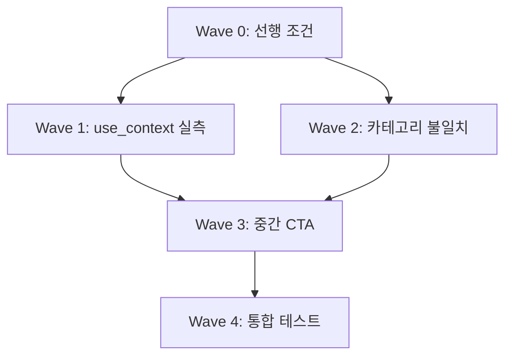

# PLAN.md — Phase 35: 실발행 재검증 + use_context 효과 실측 + 카테고리 불일치 해결 + 중간 CTA 카드 구현

---

## Phase Overview

| 항목 | 내용 |
|------|------|
| **Phase** | 35 |
| **Title** | 실발행 재검증 + use_context 효과 실측 + 카테고리 불일치 해결 + 중간 CTA 카드 구현 |
| **Status** | 📝 Planning |
| **Depends On** | Phase 33(✅ 승인됨 2026-08-02), Phase 34(✅ 승인됨 2026-08-02) |
| **Mode** | Standard |

---

## Goals

| ID | Goal | Priority | Success Criteria |
|----|------|----------|------------------|
| P0 | Chain #378, #405 실발행 재검증 | P0 | `python chain_publisher.py --chain-id 378 --publish` 3스텝 성공, #405 라이브 8종 시그니처 0건 |
| P1-1 | use_context=True 실측 검증 | P1 | Step 2/3 실제 모델 5회×2조건 → 발행후 8종 시그니처 0건 (use_context=True), 발현률 측정(False) |
| P1-2 | 카테고리 불일치 해결 | P1 | `classify_keyword('뉴발란스 740')` → `shopping_brand`, `etc` fallback 시 AI `category_guess` 존중 |
| P2-1 | 중간 CTA 카드 구현 | P2 | Step 1/2 중간 카드(dual_info) + hub URL 치환 파이프라인, 플레이스홀더 잔존 0건 |
| P2-2 | 통합 테스트 확장 | P2 | `test_t5_t6_regression.py` 확장: 실측 테스트, 카테고리 테스트, CTA 삽입 검증 |

---

## Task Breakdown

### Wave 0: 선행 조건 확인 및 사전 준비 (P0 선행)

| Task | Description | Owner | Est. | Dependencies |
|------|-------------|-------|------|--------------|
| W0-1 | Phase 33, 34 PLAN 승인 및 머지 확인 | - | 0.5d | Phase 33/34 PR 승인 |
| W0-2 | Chain #378 재발행 검증 실행 | - | 0.5d | Phase 33 머지 후 |
| W0-3 | Chain #405 라이브 검증 (8종 시그니처 0건) | - | 0.5d | Phase 34 머지 후 |

### Wave 1: use_context=True 실측 검증 및 정책 확정 (P1-1)

| Task | Description | Owner | Est. | Dependencies |
|------|-------------|-------|------|--------------|
| W1-1 | `draft_single_post`에 `force_context` 파라미터 추가 | dev | 0.5d | - |
| W1-2 | Step 2/3 각 키워드 5회 × 2조건(use_context=True/False) 실제 모델 실행 | dev | 1d | W0 완료 |
| W1-3 | 8종 시그니처 스캔 로직 공통화 (`scan_8_signatures`) | dev | 0.5d | - |
| W1-4 | use_context=True/False 비교 리포트 생성 | dev | 0.5d | W1-2 완료 |
| W1-5 | "리뷰형 step 검색 컨텍스트 우선" 정책 문서화 (CONTEXT.md) | dev | 0.5d | W1-4 완료 |

### Wave 2: 카테고리 불일치 해결 (P1-2)

| Task | Description | Owner | Est. | Dependencies |
|------|-------------|-------|------|--------------|
| W2-1 | `prompts.yaml` `shopping_brand` 패턴에 브랜드명/모델코드 추가 | dev | 0.5d | - |
| W2-2 | `chain_drafter.py` `etc` fallback 시 AI `category_guess` 존중 로직 추가 | dev | 0.5d | - |
| W2-2 | `classify_keyword` 브랜드 사전 매칭 로직 추가 (방안 B 보조) | dev | 0.5d | W2-1 완료 |
| W2-3 | 카테고리 분류 테스트 추가 (`test_chain_deriver.py` 또는 `test_mc_paths.py`) | dev | 0.5d | W2-1 완료 |

### Wave 3: 중간 CTA 카드 구현 (P2-1)

| Task | Description | Owner | Est. | Dependencies |
|------|-------------|-------|------|--------------|
| W3-1 | `mc/cta.py` `dual_info` 타입 `hub_url` 필수 파라미터로 전달 확인 | dev | 0.5d | - |
| W3-2 | `chain_card_injector.py` `_get_hub_url(chain_id)` 헬퍼 추가 | dev | 0.5d | - |
| W3-3 | `inject_cards_into_draft()` 중간 카드 로직에 `dual_info` 타입 통합 | dev | 1d | W3-1, W3-2 완료 |
| W3-4 | `config/cta_templates.yaml` `dual_info`에 `placeholder: "{{HUB_LINK}}"` 추가 | dev | 0.5d | - |
| W3-5 | `chain_publisher_core.py` 발행 시점 `{{HUB_LINK}}` → hub URL 치환 로직 추가 | dev | 0.5d | W3-3 완료 |
| W3-6 | `chain_publisher.py` 카드 주입 호출 시 `hub_url` 전달 | dev | 0.5d | W3-3 완료 |

### Wave 4: 통합 테스트 확장 및 검증 (P2-2)

| Task | Description | Owner | Est. | Dependencies |
|------|-------------|-------|------|--------------|
| W4-1 | `test_t5_t6_regression.py` 실측 테스트 확장: use_context True/False 실측 | dev | 1d | W1, W2 완료 |
| W4-2 | 카테고리 분류 테스트 추가 (`test_mc_paths.py` 또는 `test_chain_deriver.py`) | dev | 0.5d | W2 완료 |
| W4-3 | 중간 CTA 카드 삽입 검증 테스트 추가 | dev | 0.5d | W3 완료 |
| W4-4 | 플레이스홀더 잔존 검증 테스트 (`{{HUB_LINK}}`, `{{ENTRY_LINK}}` 0건) | dev | 0.5d | W3 완료 |
| W4-4 | 전체 pytest 실행 및 회귀 0건 확인 | dev | 0.5d | W4-1~3 완료 |

---

## Technical Details

### W1-1: `draft_single_post` `force_context` 파라미터 추가

**파일**: `chain_drafter.py:232`

```python
def draft_single_post(
    post: dict,
    posts: list[dict],
    seed_keyword: str,
    use_context: bool = True,
    force_context: bool = False,  # NEW: step 2/3에서 강제 적용
) -> tuple[str, dict, str]:
    ...
    # Step 2/3에서 force_context=True면 use_context 무시하고 True로 처리
    effective_context = use_context or force_context
    if effective_context:
        # 검색 컨텍스트 주입 로직
```

**호출부 수정** (`chain_drafter.py:417`):
```python
# chain_type별 step_role에 따라 force_context 결정
depth_role = get_chain_direction_role(chain_type, post.get("step", 1))
force_context = depth_role in ("분석/응용형", "전문/심화형", "절약/관리형", "금융/투자형", "비교/탐색형", "비즈니스/확정형")
draft_md, meta, raw_output = draft_single_post(post, posts, seed_keyword, use_context=use_context, force_context=force_context)
```

### W2-1: `prompts.yaml` `shopping_brand` 패턴 확장

**파일**: `config/prompts.yaml:373-375`

```yaml
shopping_brand:
  priority: 50
  patterns:
    - (쇼핑몰|브랜드|골프웨어|레깅스|원피스|블라우스|반팔|셔츠|가방|목걸이|팔찌|반지|시계|선글라스|운동복|의류|패션|스니커즈|샌들|슬리퍼)
    - (뉴발란스|나이키|아디다스|푸마|리복|아식스|스케쳐스|크록스|호카|온러닝|살로몬|언더아머|컨버스|반스|닥터마틴|팀버랜드|클락스|유니클로|자라|H&M|무신사)
    - (U740|U530|U990|530|990|740|1906|2002|327|574|990v6|990v5|990v4|990v3|990v2|990v1)
```

### W2-2: `chain_drafter.py` `etc` fallback 시 AI `category_guess` 존중

**파일**: `chain_drafter.py:258` (H2 가이드라인 선택부)

```python
# ── H2 가이드라인 동적 선택 (keyword_categories 기반) ──
kc = prompts.get("keyword_categories", {})
kw_category = classify_keyword(seed_keyword)

# NEW: etc일 때 AI 작성 category_guess 존중
if kw_category == "etc" and post.get("category_guess"):
    ai_cat = post["category_guess"]
    if ai_cat in kc:  # prompts.yaml에 해당 카테고리 설정 있으면 사용
        kw_category = ai_cat

cat_config = kc.get(kw_category) or kc.get("etc")
if not cat_config:
    raise ValueError(...)
```

### W3-2: `CardInjector._get_hub_url(chain_id)` 헬퍼

**파일**: `chain_card_injector.py` (클래스 내부에 추가)

```python
def _get_hub_url(self, chain_id: int) -> str:
    """체인 ID로 허브 페이지 URL 생성"""
    # chain_id로 시드 키워드 조회 후 slug 생성
    from chain_db import get_chain
    chain = get_chain(chain_id)
    if not chain:
        return "https://rotcha.kr/hub"  # fallback
    seed = chain["seed"]
    # slug 생성 로직 (chain_deriver.py 참고)
    slug = re.sub(r'[^\w\s-]', '', seed).strip().replace(' ', '-')
    return f"https://rotcha.kr/hub/{slug}"
```

### W3-3: `inject_cards_into_draft()` 중간 카드 로직 수정

**파일**: `chain_card_injector.py:561-573`

```python
# 중간 카드: H2>=3일 때 2번째 H2 직후 1개 (하단 카드와 별개, 총 2개 구조)
if len(h2_positions) >= 3:
    if is_last:  # Step 3
        mid_links = self.find_external_links(...)
        mid_card = self.build_external_link_card(mid_links, seed_keyword)
    else:  # Step 1, 2
        # NEW: dual_info 타입 CTA 사용 (hub URL 연결)
        hub_url = self._get_hub_url(post["chain_id"])
        mid_card = self.build_card_html("이 시리즈 전체 보기", hub_url, "이 시리즈 보기 →")
    if mid_card:
        body = self.inject_mid_card(body, mid_card)
```

### W3-4: `config/cta_templates.yaml` 플레이스홀더 추가

```yaml
dual_info:         # 정보성 중간 카드
  text: "이 시리즈 보기 →"
  style: "red-bg"
  placeholder: "{{HUB_LINK}}"  # NEW
```

### W3-5: 발행 시점 플레이스홀더 치환

**파일**: `chain_publisher_core.py` (`_sanitize_markdown_body` 내부 또는 별도 함수)

```python
def _replace_placeholders(text: str, hub_url: str, entry_url: str, funnel_url: str) -> str:
    text = text.replace("{{HUB_LINK}}", hub_url)
    text = text.replace("{{ENTRY_LINK}}", entry_url)
    text = text.replace("{{FUNNEL_LINK}}", funnel_url)
    return text
```

---

## Verification Checklist

### P0: 실발행 재검증
- [ ] `python chain_publisher.py --chain-id 378 --publish` → 3스텝 모두 `✅ Step X published: <url>`
- [ ] `python chain_publisher.py --chain-id 405 --publish` (또는 라이브 확인) → 8종 시그니처 0건

### P1-1: use_context 실측
- [ ] Step 2/3 각 키워드 5회 × 2조건 = 30회 생성 완료
- [ ] `use_context=True` → 8종 시그니처 0건 (목표 0%)
- [ ] `use_context=False` → 발현률 측정 및 기록
- [ ] "리뷰형 step 검색 컨텍스트 우선" 정책 문서화 (CONTEXT.md)

### P1-2: 카테고리 불일치
- [ ] `classify_keyword('뉴발란스 740')` → `shopping_brand`
- [ ] `classify_keyword('U740')` → `shopping_brand` (모델코드)
- [ ] `etc` fallback 시 AI `category_guess` 존중 로직 동작 확인
- [ ] pytest 회귀 0건

### P2-1: 중간 CTA 카드
- [ ] Step 1, H2≥3: 하단 chain-card + 중간 dual_info(hub) — 총 2개
- [ ] Step 2, H2≥3: 하단 chain-card + 중간 dual_info(hub) — 총 2개
- [ ] Step 3: 중간 카드 없음 (또는 external-link-card만)
- [ ] `{{HUB_LINK}}`, `{{ENTRY_LINK}}` 잔존 0건
- [ ] `{{HUB_LINK}}` → 실제 hub URL 치환 확인

### P2-2: 통합 테스트
- [ ] `test_t5_t6_regression.py` 실측 테스트 확장 통과
- [ ] 카테고리 분류 테스트 통과
- [ ] 중간 CTA 카드 삽입 검증 테스트 통과
- [ ] pytest 851+ 통과, 회귀 0건

---

## Risks & Mitigations

| Risk | Impact | Mitigation |
|------|--------|------------|
| Phase 33/34 미완료로 P0 차단 | High | Phase 33/34 완료 전까지 Phase 35 착수 보류 |
| Naver API 쿼터 초과 | Medium | 일일 25,000 쿼터 모니터링, 실패 시 graceful degradation |
| 카테고리 패턴 추가 오분류 | Low | 우선순위 조정 + 테스트 케이스 추가 |
| 중간 CTA 과다 삽입 → 광고 밀도 위반 | Medium | H2 ≥ 3 조건 유지, Step 3 중간 미삽입 |
| Hub 페이지 미구현 시 중간 CTA 무의미 | Medium | Phase 6 허브 페이지 구현 상태 사전 확인 |

---

## Timeline Estimate

| Wave | Duration | Cumulative |
|------|----------|------------|
| Wave 0 (선행) | 1.5d | 1.5d |
| Wave 1 (use_context 실측) | 2.5d | 4d |
| Wave 2 (카테고리 불일치) | 1.5d | 5.5d |
| Wave 3 (중간 CTA) | 3d | 8.5d |
| Wave 4 (통합 테스트) | 2.5d | 11d |
| **Total** | **~11 working days** | |

---

## Dependencies



---

## File Changes Summary

| File | Changes | Wave |
|------|---------|------|
| `chain_drafter.py` | `force_context` 파라미터, `etc` fallback 로직 | W1-1, W2-2 |
| `config/prompts.yaml` | `shopping_brand` 패턴 확장 | W2-1 |
| `mc/leak_defense.py` | (기존 로직 유지, 수정 없음) | - |
| `chain_card_injector.py` | `_get_hub_url`, 중간 카드 `dual_info` 통합 | W3-2, W3-3 |
| `mc/cta.py` | `dual_info` `hub_url` 파라미터 확인 | W3-1 |
| `config/cta_templates.yaml` | `dual_info.placeholder: "{{HUB_LINK}}"` | W3-4 |
| `chain_publisher_core.py` | `{{HUB_LINK}}` 치환 로직 | W3-5 |
| `chain_publisher.py` | `hub_url` 전달 | W3-6 |
| `test_t5_t6_regression.py` | 실측 테스트, 카테고리/ CTA 테스트 추가 | W4-1~4 |

---

## Acceptance Criteria

Phase 35 완료 기준:
1. ✅ Chain #378, #405 실발행 재검증 통과
2. ✅ `use_context=True` Step 2/3에서 8종 시그니처 0건 실증, 정책 문서화
3. ✅ `classify_keyword('뉴발란스 740')` → `shopping_brand`, `etc` fallback 시 AI 값 존중
4. ✅ Step 1/2 중간 CTA 카드(dual_info) 정상 삽입, `{{HUB_LINK}}` 치환, 플레이스홀더 잔존 0
5. ✅ pytest 851+ 통과, 회귀 0건, 8종 시그니처 발행후 0건 실증

---

## Next Phase Candidates

| Phase | Focus | Rationale |
|-------|-------|-----------|
| 36 | 허브 페이지 구현 + 중간 CTA 완성 | Phase 35 중간 CTA가 허브 페이지 존재 시 완성됨 |
| 37 | 무인 발행 스케줄러 (cron/launchd) | Phase 14.1 잔존 이월 |
| 38 | 슬러그 고유화 + 비의도 체인 자동 감지 | 데이터 품질 개선 |
